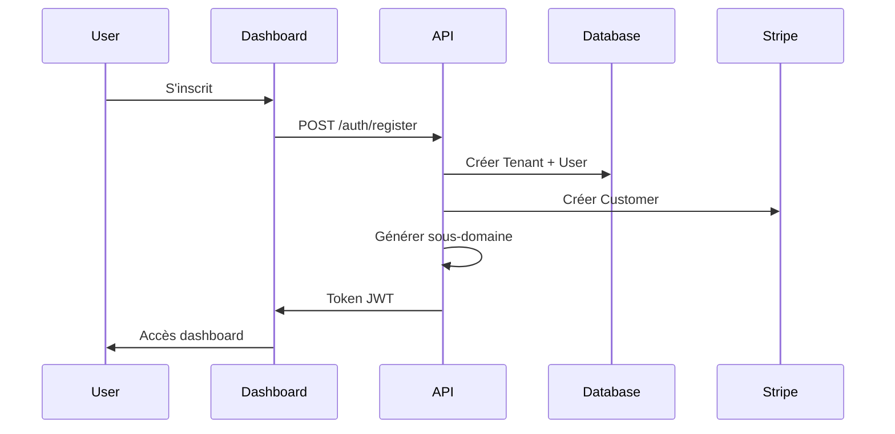
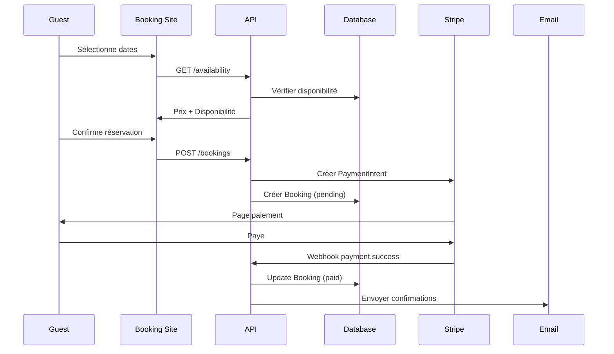
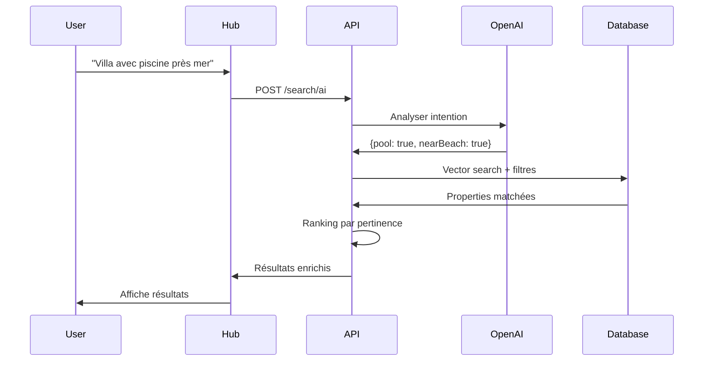

# Villa SaaS - Guide Technique pour Développeurs
## Comprendre l'Architecture et les Choix Techniques

---

## 🎯 Vue d'Ensemble du Projet

### En Une Phrase
Villa SaaS est une plateforme SaaS multi-tenant qui permet aux propriétaires de locations saisonnières d'avoir leur propre site de réservation avec paiements intégrés, et à terme un hub central avec recherche IA.

### Architecture Globale
```
┌─────────────────────────────────────────────┐
│          3 Applications Frontend             │
├─────────────┬──────────────┬────────────────┤
│   Booking   │   Dashboard  │      Hub       │
│ Site Public │    Admin     │  Marketplace   │
│  (*.domain) │ (app.domain) │ (hub.domain)   │
└──────┬──────┴───────┬──────┴────────┬───────┘
       │              │               │
       └──────────────┴───────────────┘
                      │
              ┌───────▼────────┐
              │   Backend API   │
              │   (Fastify)     │
              └───────┬────────┘
                      │
         ┌────────────┼────────────┐
         │            │            │
    ┌────▼────┐  ┌───▼───┐  ┌────▼────┐
    │Postgres │  │ Redis  │  │   S3    │
    └─────────┘  └────────┘  └─────────┘
```

---

## 🏗️ Concepts Clés à Comprendre

### 1. Multi-Tenancy (Le Plus Important)

**Qu'est-ce que c'est ?**
- Chaque client (propriétaire) = 1 tenant
- Les données sont **isolées** par tenant
- Un seul code base sert tous les clients

**Implémentation :**
```typescript
// Middleware qui s'applique à TOUTES les requêtes
async function tenantMiddleware(req, res, next) {
  // Extraction du tenant depuis le domaine
  const domain = req.hostname; // ex: villa-martin.com
  const tenant = await getTenantByDomain(domain);
  
  // Injection dans la requête
  req.tenantId = tenant.id;
  
  // Tous les queries Prisma sont automatiquement scopés
  next();
}

// Dans Prisma, TOUJOURS filtrer par tenant
const properties = await prisma.property.findMany({
  where: { 
    tenantId: req.tenantId // OBLIGATOIRE
  }
});
```

**Pourquoi c'est critique ?**
- Sécurité : Jamais de fuite de données entre clients
- Scalabilité : Facile d'ajouter des clients
- Isolation : Un bug chez un client n'affecte pas les autres

### 2. Architecture Monorepo

**Structure :**
```
villa-saas/
├── apps/
│   ├── api/          # Backend Fastify
│   ├── booking/      # Sites publics des propriétaires
│   ├── dashboard/    # Interface admin
│   └── hub/          # Future marketplace
├── packages/
│   ├── database/     # Prisma + types partagés
│   ├── ui/          # Composants React réutilisables
│   ├── utils/       # Fonctions helpers
│   └── types/       # Types TypeScript partagés
└── package.json     # Workspace pnpm
```

**Avantages :**
- Code partagé entre apps
- Types synchronisés
- Déploiement coordonné
- DRY (Don't Repeat Yourself)

### 3. Sites Custom Dynamiques

**Le défi :** Chaque propriétaire veut son propre site (villa-martin.com)

**Solution :**
```typescript
// apps/booking/app/[domain]/page.tsx
export default async function HomePage({ params }) {
  // 1. Identifier le tenant
  const tenant = await getTenantByDomain(params.domain);
  
  // 2. Charger ses propriétés
  const properties = await getProperties(tenant.id);
  
  // 3. Appliquer son thème
  const theme = tenant.settings.theme;
  
  // 4. Générer la page
  return <Homepage properties={properties} theme={theme} />;
}
```

**Routing Multi-Domain :**
```typescript
// middleware.ts
export function middleware(request: NextRequest) {
  const hostname = request.headers.get('host');
  
  // Router selon le domaine
  if (hostname.includes('app.')) {
    // Dashboard admin
    return NextResponse.rewrite('/dashboard');
  } else if (hostname.includes('hub.')) {
    // Hub central
    return NextResponse.rewrite('/hub');
  } else {
    // Site custom du propriétaire
    return NextResponse.rewrite('/booking');
  }
}
```

### 4. Préparation pour l'IA

**Pourquoi maintenant ?**
- Les données doivent être structurées dès le début
- Les embeddings nécessitent du contenu riche
- L'apprentissage demande de l'historique

**Structure de données IA-Ready :**
```typescript
// Dans la DB, on stocke des JSON riches
interface PropertyAIData {
  // Amenities structurées (pas juste un array)
  amenities: {
    essentials: { wifi: boolean, parking: boolean },
    comfort: { pool: boolean, aircon: boolean },
    family: { crib: boolean, swing: boolean }
  },
  
  // Scores d'atmosphère (pour matching sémantique)
  atmosphere: {
    romantic: number,  // 0-10
    family: number,
    business: number,
    party: number
  },
  
  // Proximités en mètres (pour "près de")
  proximity: {
    beach: number,
    shops: number,
    station: number
  }
}
```

**Pipeline d'indexation :**
```typescript
// Job qui tourne chaque nuit
async function indexForAI(property) {
  // 1. Générer texte searchable
  const text = generateSearchableText(property);
  
  // 2. Créer embedding vectoriel
  const embedding = await openai.createEmbedding(text);
  
  // 3. Stocker dans PostgreSQL + pgvector
  await prisma.property.update({
    where: { id: property.id },
    data: { 
      searchableContent: text,
      embedding: embedding.vector 
    }
  });
}
```

---

## 💻 Stack Technique Détaillé

### Backend (API)
```typescript
// Pourquoi ces choix ?
{
  "Fastify": "3x plus rapide qu'Express",
  "TypeScript": "Type safety obligatoire",
  "Prisma": "ORM type-safe avec migrations",
  "PostgreSQL": "JSONB + pgvector pour l'IA",
  "Redis": "Cache + sessions + queues",
  "BullMQ": "Jobs asynchrones (emails, exports)",
  "Zod": "Validation des données entrantes"
}
```

### Frontend (Apps)
```typescript
{
  "Next.js 14": "SSR/SSG + App Router",
  "React 18": "UI moderne",
  "Tailwind CSS": "Styling rapide",
  "Shadcn/ui": "Composants de qualité",
  "React Query": "Cache + sync serveur",
  "Zustand": "State management simple",
  "React Hook Form": "Forms performants"
}
```

### Infrastructure
```typescript
{
  "Développement": "Docker Compose local",
  "Production": {
    "Hosting": "Vercel (frontend) + Railway (backend)",
    "Database": "Supabase ou Neon (PostgreSQL)",
    "Storage": "AWS S3 ou Cloudflare R2",
    "CDN": "Cloudflare",
    "Email": "Resend ou SendGrid"
  }
}
```

---

## 🔄 Flux de Données Principaux

### 1. Création d'un Tenant


### 2. Réservation sur Site Custom


### 3. Recherche IA (Future)


---

## 🛠️ Patterns et Best Practices

### 1. Multi-Tenant Patterns
```typescript
// ❌ JAMAIS
const property = await prisma.property.findFirst({
  where: { id: propertyId }
});

// ✅ TOUJOURS
const property = await prisma.property.findFirst({
  where: { 
    id: propertyId,
    tenantId: req.tenantId // OBLIGATOIRE
  }
});

// Mieux : Utiliser un middleware Prisma
prisma.$use(async (params, next) => {
  if (params.model && params.action.startsWith('find')) {
    params.args.where = {
      ...params.args.where,
      tenantId: currentTenantId
    };
  }
  return next(params);
});
```

### 2. Type Safety
```typescript
// packages/types/index.ts
export interface CreatePropertyDTO {
  name: string;
  type: PropertyType;
  maxGuests: number;
  // ... tous les champs
}

// Utilisation partout
import { CreatePropertyDTO } from '@villa/types';

// Backend validation
const schema = z.object({
  name: z.string().min(3),
  type: z.enum(['villa', 'apartment']),
  maxGuests: z.number().positive()
});

// Frontend form
const form = useForm<CreatePropertyDTO>({
  resolver: zodResolver(schema)
});
```

### 3. Error Handling
```typescript
// Erreurs custom
export class TenantError extends Error {
  constructor(
    message: string,
    public code: string,
    public statusCode: number
  ) {
    super(message);
  }
}

// Usage
if (!tenant) {
  throw new TenantError(
    'Tenant not found',
    'TENANT_NOT_FOUND',
    404
  );
}

// Global error handler
app.setErrorHandler((error, request, reply) => {
  if (error instanceof TenantError) {
    return reply.status(error.statusCode).send({
      error: error.code,
      message: error.message
    });
  }
  // Log et retour générique
});
```

---

## 🚀 Getting Started

### 1. Setup Local
```bash
# Clone le repo
git clone https://github.com/villa-saas/villa-saas.git
cd villa-saas

# Install dependencies
pnpm install

# Setup environnement
cp .env.example .env.local

# Database
docker-compose up -d postgres redis
pnpm db:push
pnpm db:seed

# Lancer en dev
pnpm dev
```

### 2. Architecture des Branches
```
main         → Production
develop      → Integration
feature/*    → Nouvelles features
hotfix/*     → Fixes urgents
```

### 3. Workflow de Développement
1. Créer une branche feature
2. Développer avec tests
3. PR vers develop
4. Review + merge
5. Deploy automatique en staging
6. Tests QA
7. Merge vers main = production

---

## 📝 Conventions de Code

### Naming
```typescript
// Fichiers : kebab-case
property-service.ts
create-booking.dto.ts

// Classes : PascalCase
class PropertyService {}

// Interfaces : PascalCase avec I ou suffix
interface IProperty {}
interface CreateBookingDTO {}

// Functions : camelCase
function calculatePrice() {}

// Constants : UPPER_SNAKE
const MAX_GUESTS = 10;
```

### Structure des Modules
```typescript
// Chaque module a cette structure
modules/properties/
├── properties.controller.ts  // Routes
├── properties.service.ts     // Business logic
├── properties.repository.ts  // DB queries
├── properties.dto.ts         // Types/validation
└── properties.test.ts        // Tests
```

---

## 🧪 Testing Strategy

### Types de Tests
```typescript
// Unit tests (services, utils)
describe('PriceCalculator', () => {
  it('should calculate night price', () => {
    const price = calculatePrice(100, 3);
    expect(price).toBe(300);
  });
});

// Integration tests (API)
describe('POST /properties', () => {
  it('should create property for tenant', async () => {
    const response = await request(app)
      .post('/properties')
      .set('Authorization', `Bearer ${token}`)
      .send(validProperty);
      
    expect(response.status).toBe(201);
    expect(response.body.tenantId).toBe(tenantId);
  });
});

// E2E tests (user flows)
test('user can book property', async ({ page }) => {
  await page.goto('/villa-test');
  await page.selectDates('2024-07-01', '2024-07-05');
  await page.fill('[name="email"]', 'test@example.com');
  await page.click('button[type="submit"]');
  await expect(page).toHaveURL('/confirmation');
});
```

---

## 🔒 Sécurité

### Principes
1. **Isolation totale** entre tenants
2. **Validation stricte** de toutes les entrées
3. **Authentification JWT** avec refresh tokens
4. **Rate limiting** sur toutes les routes
5. **Logs d'audit** pour actions sensibles

### Implémentation
```typescript
// Rate limiting
app.register(rateLimit, {
  max: 100,
  timeWindow: '1 minute'
});

// Validation entrées
const bookingSchema = z.object({
  checkIn: z.string().datetime(),
  checkOut: z.string().datetime(),
  guests: z.number().min(1).max(property.maxGuests)
});

// Audit logs
async function logAction(userId: string, action: string, details: any) {
  await prisma.auditLog.create({
    data: { userId, action, details, ip: req.ip }
  });
}
```

---

## 📊 Monitoring & Observability

### Logs Structurés
```typescript
// Utiliser Pino pour les logs
logger.info({
  tenantId: req.tenantId,
  userId: req.userId,
  action: 'property.created',
  propertyId: property.id,
  duration: Date.now() - start
});
```

### Métriques Clés
- Response time par endpoint
- Taux d'erreur par tenant
- Utilisation DB/Redis
- Queue jobs status
- Stripe webhooks failures

---

## 🤝 Collaboration

### Pour les PR
1. Description claire du changement
2. Tests ajoutés/modifiés
3. Documentation mise à jour
4. Pas de console.log oubliés
5. Respect des conventions

### Communication
- Questions techniques : GitHub Discussions
- Bugs : GitHub Issues
- Architecture : ADR (Architecture Decision Records)
- Daily standup : 9h30

---

## 📚 Ressources

### Documentation
- [Prisma Docs](https://www.prisma.io/docs)
- [Fastify Best Practices](https://www.fastify.io/docs/latest/)
- [Next.js App Router](https://nextjs.org/docs)
- [Stripe Connect Guide](https://stripe.com/docs/connect)

### Outils Internes
- Figma : Maquettes UI/UX
- Linear : Gestion des tâches
- Notion : Documentation produit
- Slack : Communication équipe

---

## ❓ FAQ Développeur

**Q: Pourquoi pas de microservices ?**
> R: Complexité inutile pour notre taille. Monolithe modulaire d'abord, microservices si besoin dans 2-3 ans.

**Q: Pourquoi Fastify et pas NestJS ?**
> R: Performance critique + Plus simple pour notre cas. NestJS over-engineered pour nos besoins.

**Q: Comment gérer les migrations DB ?**
> R: Prisma migrations en dev, avec review obligatoire en prod. Toujours tester sur une copie d'abord.

**Q: Quelle est la stratégie de cache ?**
> R: Redis pour sessions + cache API. CDN pour assets. ISR pour pages publiques.

**Q: Comment on gère les timezones ?**
> R: Tout en UTC dans la DB. Conversion côté client selon leur timezone.

---

## 🚨 Points d'Attention Critiques

1. **JAMAIS exposer des données cross-tenant**
2. **TOUJOURS valider les entrées utilisateur**
3. **TESTER les flows de paiement en sandbox**
4. **MONITORER les performances dès le début**
5. **DOCUMENTER les décisions architecturales**

---

**"Build it right from the start, but ship it fast"**